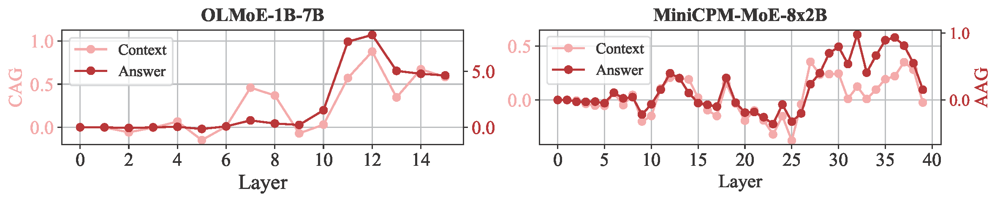

<div id="top">

<!-- HEADER STYLE: CLASSIC -->
<div align="center">

# RouterLens: Eliciting and Leveraging your Specialized MoE Experts

<em></em>

<!-- BADGES -->
<!-- local repository, no metadata badges. -->

<a href="https://github.com/bigai-nlco/RuleReasoner/blob/main/LICENSE">
	
</a>
<!-- <a href="https://arxiv.org/abs/2506.08672">
	
</a> -->


</div>
<br>

<div align="center">
  
</div>

## 📍 TL;DR
Experts in Mixture-of-Experts (MoE) LLMs have been shown to specialize in different aspects (e.g., domains, tasks, etc.). However, these specializations are often suppressed by the load-balancing constraint. To better elicit specialized experts, we introduce **RouterLens**, a lightweight tool that effectively identifies experts. We show its effectiveness in identifying experts specialized in leveraging context (i.e., *context-faithful experts*). Building on this, we propose **Context-faithful Expert Fine-Tuning (CEFT)** — a parameter-efficient tuning approach that achieves performance comparable to full fine-tuning while significantly reducing the number of trainable parameters.


## 🗺️ Table of Contents

- [📍 TL;DR](#-tldr)
- [🗺️ Table of Contents](#-table-of-contents)
- [🎯 Quick Start](#-quick-start)
  - [Installation](#installation)
  - [Eliciting Context-faithful Experts](#eliciting-context-faithful-experts)
  - [Efficient Context-faithful Optimization](#efficient-context-faithful-optimization)
- [📋 Quantitative Results](#-quantitative-results)
- [⚙️ Internal Working of Context-faithful Experts](#⚙️-internal-working-of-context-faithful-experts)
- [©️ License](#️-license)
- [🔖 Citation](#-citation)

## 🎯 Quick Start

### Installation

Build RouterLens from the source and install dependencies:

```bash
❯ git clone https://github.com/bigai-nlco/RouterLens.git
❯ cd RouterLens
❯ conda env create -f environment.yml
❯ conda activate routerlens
```
### Eliciting Context-faithful Experts

Run the router training with:

```bash
❯ ./run_router_tuning.sh
```

Count the activation frequency of experts and identify the top-activated ones as context-faithful experts with:

```bash
❯ ./run_exp_act_count.sh
```


### Efficient Context-faithful Optimization

Run the context-faithful expert tuning with:

```bash
❯ ./run_ceft_tuning.sh
```

## 📋 Quantitative Results

<p align="center">
  
</p>
<p align="left">
  <em><strong>Figure 1</strong>: Router tuning can significantly improve the performance of MoE on context-dependent tasks, indicating the presence of experts specialized in context utilization.</em>
</p>

<p align="center">
  
</p>
<p align="left">
  <em><strong>Figure 2</strong>: Masking the top-activated experts from the router-tuned (RT) model (i.e., context-faithful experts, CE) significantly degrades performance on context-dependent tasks.</em>
</p>


<p align="center">
  
</p>
<p align="left">
  <em><strong>Figure 3</strong>: CEFT can achieve performance comparable to full fine-tuning (FFT) while requiring significantly fewer trainable parameters.</em>
</p>


## ⚙️ Internal Working of Context-faithful Experts

<!-- ### Attention Gain on Context and Answer -->

<p align="center">
  
</p>
<p align="left">
  <em><strong>Figure 1</strong>: Layer-wise attention gain on context and answer (CAG and AAG) for the router-tuned model over the untuned model on the NQ-Swap test set.</em>
</p>

<p align="center">
  
  
</p>
<p align="left">
  <em><strong>Figure 2</strong>: Attention gain from context-faithful experts in OLMoE-1B-7B on an NQ-Swap example. At Layer 6 (left) and Layer 12 (right), i.e., mid-level layer and deeper layer, the router-tuned model progressively increases attention to the context and answer tokens (i.e., ``1964''), illustrating a ``think twice'' mechanism. Notably, the base model fails on this example, while the router-tuned model provides the correct answer.</em>
</p>


<p align="center">
  
</p>
<p align="left">
  <em><strong>Figure 3</strong>: Answer Probability Gain (APG) of the router-tuned models over their untuned counterparts on the NQ-Swap test set.</em>
</p>


## ©️ License

RouterLens is licensed under the [MIT License](https://choosealicense.com/licenses). You are free to use, modify, and distribute this project under the terms of the MIT license.

## 🔖 Citation
<!-- ```latex
@article{bai2025routerlens,
      title={Understanding and Leveraging the Expert Specialization of Context Faithfulness in Mixture-of-Experts LLMs}, 
      author={Jun Bai and Minghao Tong and Yang Liu and Zixia Jia and Zilong Zheng},
      year={2025},
      eprint={2508.},
      archivePrefix={arXiv},
      primaryClass={cs.CL},
      url={https://arxiv.org/abs/2508}, 
}
``` -->